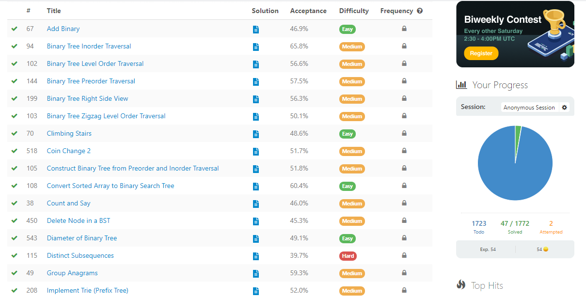

# Leet-Code-Solution
<h1 align="center">
  This is my Leet-Code Solution
</h1>
<a href="https://github.com/ashish2030/LeetCode-Solutions/fork" target="blank">

  
</a>

  

  

<h3>A lot of software gets written in spaces where optimality doesn’t matter because a lot of smart people have engineered the system to make it irrelevant.</h3>
